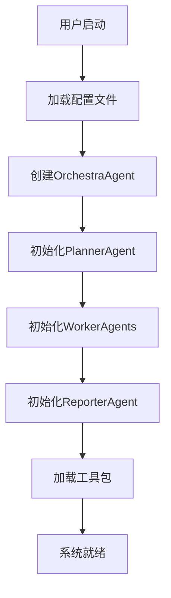
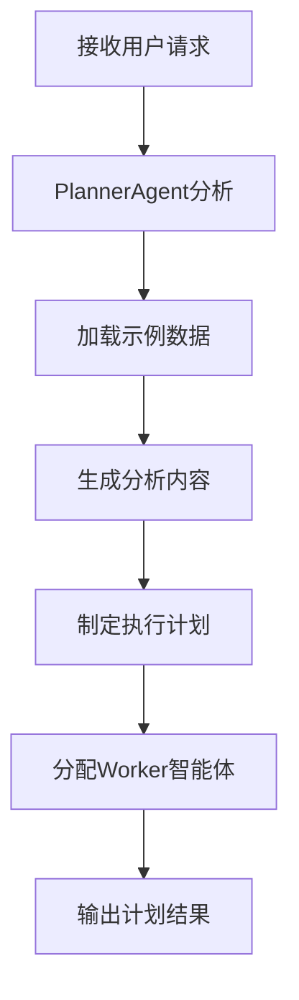
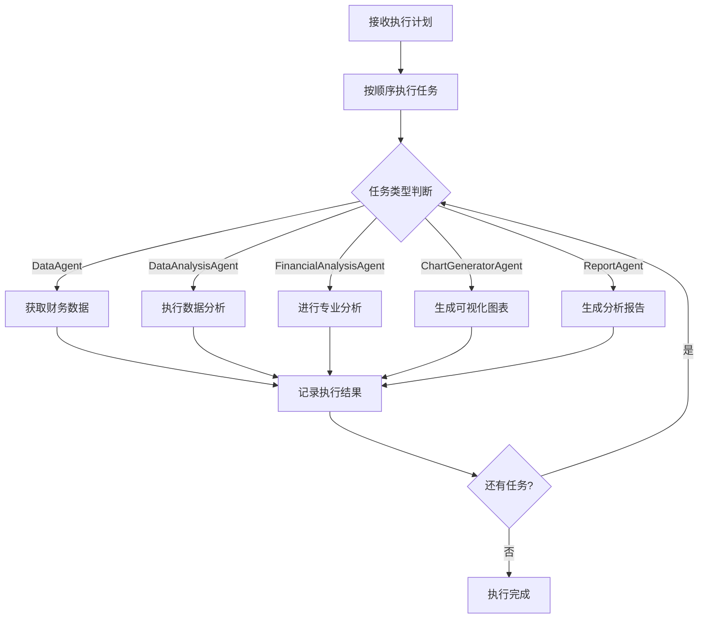
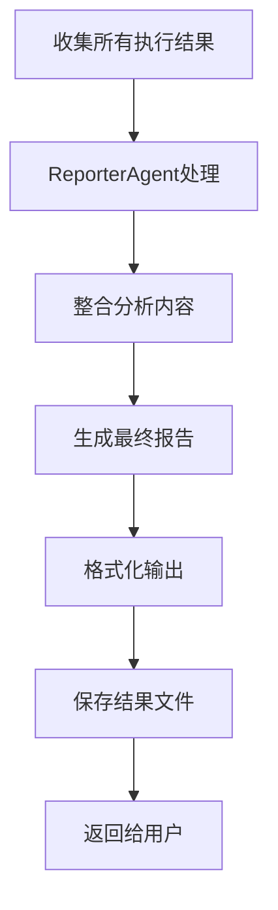
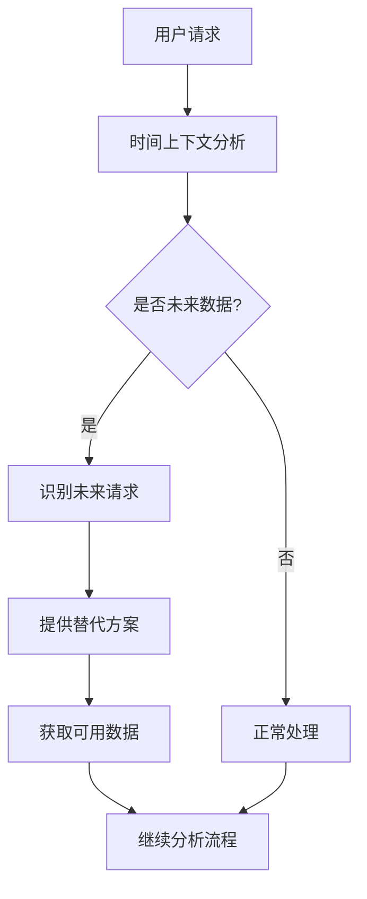

# 多智能体系统工作流程文档

## 📋 目录

1. [系统架构概述](#系统架构概述)
2. [核心组件详解](#核心组件详解)
3. [完整工作流程](#完整工作流程)
4. [智能体协作机制](#智能体协作机制)
5. [错误处理流程](#错误处理流程)
6. [时间感知集成](#时间感知集成)
7. [配置系统](#配置系统)
8. [日志和调试](#日志和调试)

## 🏗️ 系统架构概述

### 整体架构图

```
┌─────────────────────────────────────────────────────────────┐
│                    OrchestraAgent                           │
│                   (核心协调器)                                │
├─────────────────────────────────────────────────────────────┤
│  ┌─────────────┐  ┌─────────────┐  ┌─────────────┐           │
│  │PlannerAgent │  │WorkerAgents │  │ReporterAgent│           │
│  │  (任务规划)  │  │ (任务执行)  │  │ (报告生成)  │           │
│  └─────────────┘  └─────────────┘  └─────────────┘           │
│         │               │               │                   │
│         └───────────────┼───────────────┘                   │
│                         │                                   │
│  ┌─────────────────────────────────────────────────────┐   │
│  │            工具包系统 (Toolkits)                      │   │
│  │ ┌──────────┐ ┌──────────┐ ┌──────────┐ ┌─────────┐ │   │
│  │ │Datetime  │ │AKShare   │ │Financial │ │Report   │ │   │
│  │ │Toolkit   │ │Tool      │ │Analysis  │ │Saver    │ │   │
│  │ └──────────┘ └──────────┘ └──────────┘ └─────────┘ │   │
│  └─────────────────────────────────────────────────────┘   │
└─────────────────────────────────────────────────────────────┘
```

### 核心设计原则

1. **分层架构**: 协调层 + 执行层 + 工具层
2. **模块化设计**: 每个智能体职责单一，可独立替换
3. **配置驱动**: 通过配置文件控制行为
4. **流式处理**: 支持实时输出和状态更新
5. **时间感知**: 内置时间判断和数据可用性检查

## 🔧 核心组件详解

### 1. OrchestraAgent (核心协调器)

**位置**: `utu/agents/orchestra_agent.py`

**职责**:
- 初始化和管理所有子智能体
- 协调任务执行流程
- 管理任务记录器
- 处理流式输出

**关键方法**:
```python
async def run(input: str, trace_id: str = None) -> OrchestraTaskRecorder
def run_streamed(input: str, trace_id: str = None) -> OrchestraTaskRecorder
async def build()  # 初始化所有子智能体
```

**工作流程**:
1. 初始化 → 2. 计划制定 → 3. 任务执行 → 4. 结果报告

### 2. PlannerAgent (任务规划器)

**位置**: `utu/agents/orchestra/planner.py`

**职责**:
- 分析用户请求
- 制定执行计划
- 分配任务给合适的Worker智能体
- 管理示例数据

**核心功能**:
```python
async def create_plan(task_recorder: OrchestraTaskRecorder) -> CreatePlanResult
```

**输出解析器**:
- 分析阶段: `<analysis>...</analysis>`
- 计划阶段: `<plan>[...]</plan>`
- 任务格式: `{"agent_name": "...", "task": "...", "completed": false}`

### 3. WorkerAgents (任务执行器)

**位置**: `utu/agents/orchestra/worker.py`

**类型**:
- **DataAgent**: 财务数据获取专家
- **DataAnalysisAgent**: 数据分析专家
- **FinancialAnalysisAgent**: 财务分析专家
- **ChartGeneratorAgent**: 图表生成专家
- **ReportAgent**: 报告生成专家

**工作模式**:
```python
async def work(task_recorder: OrchestraTaskRecorder, subtask: Subtask) -> WorkerResult
def work_streamed(task_recorder: OrchestraTaskRecorder, subtask: Subtask) -> WorkerResult
```

### 4. ReporterAgent (报告生成器)

**位置**: `utu/agents/orchestra/reporter.py`

**职责**:
- 整合所有执行结果
- 生成最终分析报告
- 格式化输出内容

**核心功能**:
```python
async def report(task_recorder: OrchestraTaskRecorder) -> AnalysisResult
```

## 🔄 完整工作流程

### 阶段1: 系统初始化



**详细步骤**:
1. **配置加载**: 从YAML文件加载智能体配置
2. **智能体创建**: 根据配置创建各个子智能体
3. **工具包集成**: 加载并配置所有工具包
4. **连接建立**: 建立智能体间的通信连接

### 阶段2: 任务规划



**PlannerAgent处理流程**:
1. **请求分析**: 解析用户需求和上下文
2. **示例匹配**: 从示例库中匹配相似场景
3. **智能体选择**: 根据任务类型选择合适的Worker
4. **计划生成**: 创建结构化的任务列表
5. **时间检查**: 验证数据可用性和时间合理性

### 阶段3: 任务执行



**每个Worker的执行流程**:
1. **任务接收**: 获取分配的具体任务
2. **上下文构建**: 整合之前的执行结果
3. **工具调用**: 使用相应的工具包完成任务
4. **结果记录**: 保存执行结果和轨迹
5. **状态更新**: 更新任务执行状态

### 阶段4: 结果报告



## 🤝 智能体协作机制

### 数据传递机制

```python
class OrchestraTaskRecorder:
    plan: CreatePlanResult           # 执行计划
    task_records: list[WorkerResult] # 任务执行记录
    trajectories: list[dict]         # 执行轨迹
    final_output: str               # 最终输出
```

### 状态同步

1. **任务状态**: 每个Subtask包含completed状态
2. **执行轨迹**: 记录每个智能体的完整执行过程
3. **结果聚合**: 逐步构建最终的分析结果

### 错误传播

```python
# 错误处理流程
try:
    result = await agent.work(task_recorder, subtask)
except Exception as e:
    # 记录错误信息
    error_info = {
        "agent": subtask.agent_name,
        "task": subtask.task,
        "error": str(e),
        "traceback": traceback.format_exc()
    }
    # 决定是否继续执行或终止
```

## ⚠️ 错误处理流程

### 错误分类

1. **配置错误**: 智能体配置问题
2. **工具错误**: 工具包调用失败
3. **数据错误**: 数据获取或处理失败
4. **网络错误**: API调用超时或失败
5. **逻辑错误**: 智能体推理错误

### 错误处理策略

```python
class ErrorHandler:
    def handle_error(self, error: Exception, context: dict) -> ErrorAction:
        # 1. 记录详细错误信息
        self.log_error(error, context)

        # 2. 分析错误类型
        error_type = self.classify_error(error)

        # 3. 决定处理策略
        if error_type == "recoverable":
            return ErrorAction.RETRY
        elif error_type == "skipable":
            return ErrorAction.SKIP
        else:
            return ErrorAction.ABORT
```

### 恢复机制

1. **自动重试**: 对于临时性错误进行重试
2. **降级处理**: 使用备用方案继续执行
3. **部分完成**: 即使部分任务失败也生成报告
4. **用户通知**: 清晰地告知用户遇到的问题

## 🕐 时间感知集成

### 时间感知工作流程



### 时间感知组件

1. **DateTimeToolkit**: 时间检查和验证
2. **AKShare增强**: 数据可用性检查
3. **智能体集成**: 时间感知的工作流程

### 时间感知示例

**输入**: "分析2025年贵州茅台的财报数据"

**处理流程**:
1. 检测到"2025年"是未来时间
2. 验证2025年财报尚未发布
3. 建议使用2024年或最新可用数据
4. 继续基于可用数据进行分析

## ⚙️ 配置系统

### 配置文件结构

```
configs/
├── agents/
│   ├── base.yaml              # 基础配置
│   └── examples/
│       └── stock_analysis_final.yaml  # 股票分析配置
├── tools/
│   ├── akshare_financial_data.yaml
│   ├── financial_analysis.yaml
│   ├── datetime.yaml          # 时间工具配置
│   └── ...
└── model/
    └── base.yaml              # 模型配置
```

### 关键配置项

```yaml
# 智能体配置
type: orchestra
planner_config:
  examples_path: stock_analysis_examples.json
  max_plan_length: 1000
  enable_context_compression: true

# 工具包配置
toolkits:
  datetime:
    config:
      timezone: "Asia/Shanghai"
      financial_reporting_rules:
        q1_deadline: "04-30"
        q2_deadline: "08-31"
        q3_deadline: "10-31"
        q4_deadline: "04-30"
```

## 📊 日志和调试

### 日志系统架构

```python
class OrchestraLogger:
    def __init__(self, config: dict):
        self.log_file = config.get("log_file", "orchestra.log")
        self.log_level = config.get("log_level", "INFO")
        self.format = "json"  # 结构化JSON格式

    def log_agent_event(self, agent_name: str, event: dict):
        """记录智能体事件"""
        log_entry = {
            "timestamp": datetime.utcnow().isoformat(),
            "trace_id": event.get("trace_id"),
            "agent_name": agent_name,
            "event_type": event.get("type"),
            "status": event.get("status"),
            "duration_ms": event.get("duration_ms"),
            "data": event.get("data"),
            "error": event.get("error")
        }
        self.write_log(log_entry)
```

### 日志数据结构

```json
{
  "timestamp": "2025-10-24T21:00:00.123Z",
  "trace_id": "trace_abc123",
  "session_id": "session_def456",
  "agent_name": "DataAgent",
  "event_type": "task_execution",
  "status": "completed",
  "duration_ms": 1500,
  "input": {
    "task": "获取陕西建工财务数据",
    "parameters": {...}
  },
  "output": {
    "result": "数据获取成功",
    "data_summary": {...}
  },
  "tools_used": ["get_financial_reports", "check_latest_available_report"],
  "error": null,
  "metadata": {
    "workspace": "./stock_analysis_workspace",
    "cache_hit": false
  }
}
```

### 调试功能

1. **实时日志**: 流式显示执行过程
2. **性能监控**: 记录每个步骤的执行时间
3. **错误追踪**: 详细的错误信息和堆栈跟踪
4. **结果验证**: 检查输出结果的合理性

### 调试工具

```python
# 日志分析脚本
python scripts/analyze_orchestra_logs.py --log-file orchestra.log --trace-id trace_abc123

# 实时监控
python scripts/monitor_orchestra.py --config configs/monitoring.yaml
```

## 🚀 性能优化

### 并行执行

虽然当前是串行执行，但架构支持未来的并行化：

```python
# 未来可能的并行执行实现
async def execute_parallel(self, tasks: list[Subtask]) -> list[WorkerResult]:
    """并行执行独立的任务"""
    semaphore = asyncio.Semaphore(self.max_concurrent_tasks)

    async def execute_with_semaphore(task):
        async with semaphore:
            return await self.work(task_recorder, task)

    return await asyncio.gather(*[
        execute_with_semaphore(task) for task in tasks
    ])
```

### 缓存机制

1. **数据缓存**: AKShare工具的智能缓存
2. **结果缓存**: 相同请求的结果复用
3. **配置缓存**: 配置文件的内存缓存

### 内存管理

1. **上下文压缩**: 限制传递的上下文长度
2. **轨迹清理**: 定期清理过长的执行轨迹
3. **垃圾回收**: 及时释放不需要的对象

## 📝 使用示例

### 基本使用

```python
import asyncio
from utu.agents import OrchestraAgent

async def main():
    # 创建智能体
    config = ConfigLoader.load_agent_config("examples/stock_analysis_final")
    agent = OrchestraAgent(config)
    await agent.build()

    # 执行任务
    result = await agent.run("分析贵州茅台的最新财务数据")
    print(result.final_output)

if __name__ == "__main__":
    asyncio.run(main())
```

### 流式输出

```python
# 启用流式输出
result_stream = agent.run_streamed("分析贵州茅台财务数据")
async for event in result_stream.stream_events():
    print(f"[{event.agent_name}] {event.content}")

# 获取最终结果
final_output = result_stream.final_output
```

## 🔧 故障排除

### 常见问题

1. **配置加载失败**
   - 检查YAML文件语法
   - 验证文件路径是否正确
   - 确认必需的环境变量

2. **智能体初始化失败**
   - 检查API密钥配置
   - 验证网络连接
   - 查看工具包依赖

3. **任务执行超时**
   - 增加timeout配置
   - 检查网络稳定性
   - 优化工具调用逻辑

### 调试技巧

1. **启用详细日志**:
   ```python
   import logging
   logging.basicConfig(level=logging.DEBUG)
   ```

2. **使用trace_id跟踪**:
   ```python
   result = await agent.run("分析任务", trace_id="debug_123")
   # 日志中将包含此trace_id
   ```

3. **检查中间结果**:
   ```python
   print(f"计划: {result.plan}")
   print(f"任务记录: {result.task_records}")
   ```

---

## 📚 相关文档

- [配置系统文档](./config.md)
- [工具包文档](../ref/tool/)
- [智能体文档](../ref/agents/)
- [时间感知功能](../TIME_AWARE_FIX_SUMMARY.md)

---

*本文档持续更新中，如有问题请提交Issue或PR。*